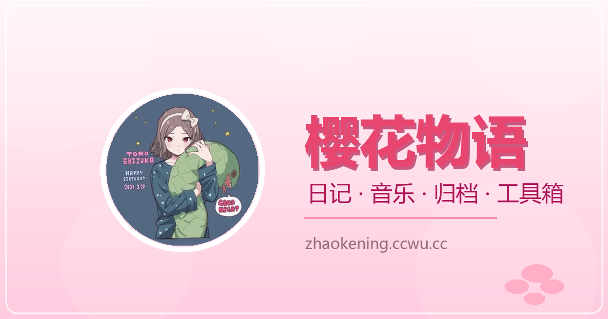

<div align="center">

<a href="https://zhaokening.ccwu.cc/">
  
</a>

<br>

<a href="https://zhaokening.ccwu.cc/"></a>
<a href="https://github.com/U1s1-king/king.github.io"></a>
<a href="https://github.com/U1s1-king/king.github.io/forks"></a>

<br><br>

# ZHAOKENING

**A little corner of the internet, built to feel like its own world.**

A personal website built as a small digital world — part journal, part archive, part playground.  
Browse the pages below, or jump straight to what you came for.

<a href="https://zhaokening.ccwu.cc/">
  
</a>

**[ ENTER THE SPACE ↗ ](https://zhaokening.ccwu.cc/)**

<sub>QUICK NAVIGATION</sub>

[HOME](https://zhaokening.ccwu.cc/home.html) · [JOURNAL](https://zhaokening.ccwu.cc/Journal.html) · [ARCHIVES](https://zhaokening.ccwu.cc/Archives.html) · [MUSIC](https://zhaokening.ccwu.cc/music.html) · [TOOLS](https://zhaokening.ccwu.cc/Tools.html) · [GAMES](https://zhaokening.ccwu.cc/Games.html) · [TV](https://zhaokening.ccwu.cc/TV.html)

</div>

---

<div align="center">


### EXPLORE THE SPACE

Seven destinations. Seven distinct motions. One connected world.

</div>

## 01 — THE ENTRY

Start here. The home page is the threshold into everything else.

<a href="https://zhaokening.ccwu.cc/home.html"></a>

## 02 — MEMORY & RECORDS

A place for passing thoughts and things worth keeping.

<a href="https://zhaokening.ccwu.cc/Journal.html"></a>

<a href="https://zhaokening.ccwu.cc/Archives.html"></a>

## 03 — SOUND, TOOLS & PLAY

Different ways to spend time here: listen, make something easier, play a little, or settle in for a show.

<a href="https://zhaokening.ccwu.cc/music.html"></a>

<a href="https://zhaokening.ccwu.cc/Tools.html"></a>

<a href="https://zhaokening.ccwu.cc/Games.html"></a>

<a href="https://zhaokening.ccwu.cc/TV.html"></a>

---

<div align="center">

### UNDER THE SURFACE

A lightweight web foundation, with each destination carrying its own character.


</div>

| Layer | Foundation |
| --- | --- |
| Interface | HTML · CSS · Vanilla JavaScript |
| Hosting & edge | GitHub Pages · Cloudflare |
| Serverless services | Cloudflare Workers |
| Storage | JSONBin · Cloudflare KV |
| Community | giscus · GitHub Discussions |
| Character | Live2D · Cubism |
| Automation & cache | GitHub Actions · Service Worker |

<details>
<summary><strong>Run locally</strong></summary>

Clone the repository and start the local server:

```bash
git clone https://github.com/U1s1-king/king.github.io.git
cd king.github.io
node server.js
```

Then open [http://127.0.0.1:8888](http://127.0.0.1:8888).

</details>

<details>
<summary><strong>Project structure</strong></summary>

```text
ZHAOKENING
├── HOME
├── JOURNAL
├── ARCHIVES
├── MUSIC
├── TOOLS
├── GAMES
└── TV
```

The site is organized as a set of focused destinations rather than one monolithic page. The README's animated panels link directly to their corresponding pages.

</details>

<div align="center">


> **Built with code. Connected by feeling.**

<a href="https://zhaokening.ccwu.cc/"></a>
<a href="https://github.com/U1s1-king/king.github.io"></a>

<br><br>


**THIS IS ZHAOKENING'S WORLD**

</div>
